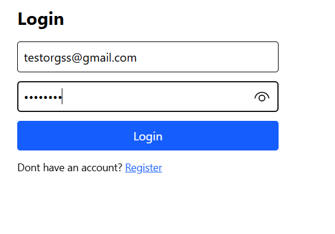

# OrgSync

OrgSync is a full-stack web application for organizations to manage their members, events, and communications in one place.  
It provides tools for scheduling events, managing membership data, sending newsletters, generating QR codes, and viewing analytics.  
The application is built with a **Django REST Framework backend** and a **Vite + React.js frontend**, styled with Tailwind CSS.

---

##  Purpose
The purpose of OrgSync is to streamline organizational workflows, enabling teams to:
- Keep track of members and their details.
- Plan and manage upcoming events.
- Distribute newsletters easily.
- Share information with QR codes.
- Visualize activity through analytics dashboards.

---

## Installation & Setup

### Backend (Django)
1. **Clone the repository**
   ```bash
   git clone https://github.com/yourusername/OrgSync.git
   cd OrgSync/backend

## 2. Create and activate a virtual environment

> Make sure you have **Python 3.11+** installed.

### macOS / Linux
```bash
python3 -m venv env
source env/bin/activate
```
### Windows
```bash
python -m venv env
.\env\Scripts\Activate.ps1
```

## 3. Install backend dependencies

With your virtual environment activated, install all Python dependencies from `requirements.txt`.

```bash
pip install -r requirements.txt
```

## 4. Set up the database

Apply database migrations to create all required tables.

### macOS / Linux / Windowa
```bash
python manage.py migrate
```

## 5. Start the backend server

Launch the Django development server.

### macOS / Linux / Windows
```bash
python manage.py runserver
```

The API will be available at http://127.0.0.1:8000/.
Keep this terminal running while you work on the frontend.

## 6. Set up the frontend

Open a **new terminal** for the frontend (keep the backend running).

### macOS / Linux / Windows 
```bash
cd ../frontend
npm install
npm run dev
```
The app will start at http://localhost:5173 and talk to your backend at http://127.0.0.1:8000 via the VITE_API_URL environment variable. 


##  Feature List 

### 1) Authentication (Login & Register)
- Secure org-based authentication using JWT.
- Axios interceptor attaches `Authorization: Bearer <token>` automatically.

**Screenshots**




---


