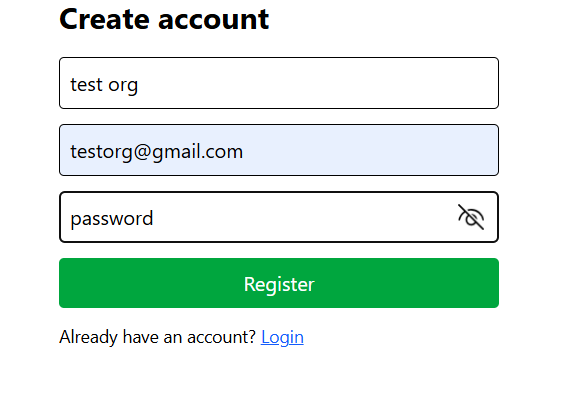

# OrgSync

OrgSync is a full-stack web application for organizations to manage their members, events, and communications in one place.  
It provides tools for scheduling events, managing membership data, sending newsletters, generating QR codes, and viewing analytics.  
The application is built with a **Django REST Framework backend** and a **Vite + React.js frontend**, styled with Tailwind CSS.

---

##  Purpose
The purpose of OrgSync is to streamline organizational workflows, enabling teams to:
- Keep track of members and their details.
- Plan and manage upcoming events.
- Distribute newsletters easily.
- Share information with QR codes.
- Visualize activity through analytics dashboards.

---

## Installation & Setup

### Backend (Django)
1. **Clone the repository**
   ```bash
   git clone https://github.com/yourusername/OrgSync.git
   cd OrgSync/backend

## 2. Create and activate a virtual environment

> Make sure you have **Python 3.11+** installed.

### macOS / Linux
```bash
python3 -m venv env
source env/bin/activate
```
### Windows
```bash
python -m venv env
.\env\Scripts\Activate.ps1
```

## 3. Install backend dependencies

With your virtual environment activated, install all Python dependencies from `requirements.txt`.

```bash
pip install -r requirements.txt
```

## 4. Set up the database

Apply database migrations to create all required tables.

### macOS / Linux / Windowa
```bash
python manage.py migrate
```

## 5. Start the backend server

Launch the Django development server.

### macOS / Linux / Windows
```bash
python manage.py runserver
```

The API will be available at http://127.0.0.1:8000/.
Keep this terminal running while you work on the frontend.

## 6. Set up the frontend

Open a **new terminal** for the frontend (keep the backend running).

### macOS / Linux / Windows 
```bash
cd ../frontend
npm install
npm run dev
```
The app will start at http://localhost:5173 and talk to your backend at http://127.0.0.1:8000 via the VITE_API_URL environment variable. 


##  Feature List 

### 1) Authentication (Login & Register)
- Secure org-based authentication using JWT.
- Axios interceptor attaches `Authorization: Bearer <token>` automatically.

**Screenshots**




---

### 2) Home Dashboard
- Shows the signed-in organization’s **name** and **email**.
- Quick access to Events, Members, QR Code, Analytics.
- Simple text editor block for future newsletter/event drafting.

**Screenshot**
- `docs/screenshots/HomeDashBoard.png`


---

### 3) Events
- **Add Event** modal appears in-page, posts to backend, and refreshes list.
- Backend returns events filtered and ordered by scope.

**Screenshots**


---

### 4) Members
- Read-only list of members in the organization.

**Screenshot**
- `docs/screenshots/OrgSyncBlankMembers.png`
- `docs/screenshots/OrgSyncFilledMembers.png`


---

### 5) QR Code
- Displays a **static QR image** that points to a URL.
- **Download** / **Share** buttons (currently show alerts; wire up later to real actions).

**Screenshot**
- `docs/screenshots/QRSkeletonDownload.png`


---

### 6) Analytics
- **Recharts** vertical bar chart for “Newsletters Sent” (sample data).
- **D3** animated horizontal bars for “New Members per Month” (sample data with smooth growth animation).

**Screenshots**
- `docs/screenshots/OrgSyncAnalytics.png`  


---

## Tech Stack

**Development & Tooling**
- **[Postman](https://www.postman.com/)** – API testing and debugging.
- **[Lucidchart](https://www.lucidchart.com/)** – UML diagram and flowchart tool for system design and architecture planning.
  Link https://lucid.app/lucidchart/32714479-ae27-4080-b3e1-188509e2d923/edit?viewport_loc=3299%2C168%2C1443%2C841%2CHWEp-vi-RSFO&invitationId=inv_bc74c5c6-9097-42f9-a05c-46772ba8ea1c
- **[Figma](https://figma.com/)** – Design and prototyping tool for UI/UX workflows.
  Link: https://www.figma.com/design/4iPDWN0hGtAl8Moz5OVbYt/Newsletter?node-id=0-1&t=8wAUmjnbXVATMgcR-1

**Backend**
- **[Django](https://www.djangoproject.com/)** – Backend Python web framework 
- **[Django REST Framework (DRF)](https://www.django-rest-framework.org/)** – API toolkit for RESTful endpoints.
- **[SQLite](https://www.sqlite.org/)** – Lightweight database used for local development.
- **[JWT Authentication](https://django-rest-framework-simplejwt.readthedocs.io/en/latest/)** – Secure token-based auth

**Frontend**
- **[React](https://reactjs.org/)** – JavaScript library for building user interfaces.
- **[Vite](https://vitejs.dev/)** – Frontend tooling for react app
- **[Tailwind CSS](https://tailwindcss.com/)** – CSS framework for fast ui designs.
- **[React Router v7](https://reactrouter.com/)** – Declarative routing for React applications.
- **[Axios](https://axios-http.com/)** – HTTP client for API requests.

**Data Visualization**
- **[Recharts](https://recharts.org/en-US/)** – Charting library for React components.
- **[D3.js](https://d3js.org/)** – Data-driven document manipulation for custom visualizations.


## Demo Video


[![Watch the video]](docs/video/demovideo.mp4)


## Future Development Roadmap

### Short-Term Goals 

- **Member Management**
  - Add role-based access control (e.g., Admin, Editor, Viewer).
  - Enable CSV import/export for members.
- **QR Code Feature**
  - Replace static QR code with dynamically generated codes per organization.
  - Implement QR code scanning for event check-ins.
- **Settings**
  - Give orgs customzation over UI and other settings.

### Mid-Term Goals 
- **Analytics & Reporting**
  - Expand data visualizations with real-time updates.
  - Generate downloadable PDF reports of member activity and event stats.
- **Email Campaign Integration**
  - Enable bulk email sending to members.
  - Include email open/click tracking.


### Long-Term Goals 
- **External Integrations**
  - Connect with Google Calendar, Outlook, or other scheduling APIs.
- **Deployment & Scaling**
  - Migrate from SQLite to PostgreSQL for production.
  - Deploy on cloud infrastructure (e.g., AWS, Azure, or Heroku).
 

## Contact Me


- **Name:** Gunnar Montes  
- **Email:** [gunnarmontes@vt.edu](mailto:gunnarmontes@vt.edu)  

 


